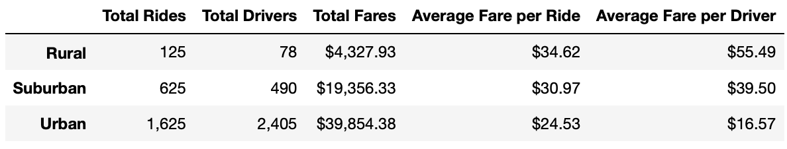

# PyBer_Analysis

## Overview of the project

The purpose of this analysis was to organize the data by city type and get the total number of rides, drivers, and fares as well as the averages. 

Then we organized everything by date, we display the data by weeks. Then we took all of this information and displayed it in a graph so it would be easier for us to explain and for others to see

## Results

After we analyze the ride-sharing app we can reach some conclusions: 

- The Rural city types have fewer rides and drivers than the other two city types because of this, the average fare is higher.

- The Suburban city type is in second place for the number of rides and drivers and the average fares.

- The Urban city type has the largest number of rides and drivers but has the lowest fares.

- When we group the data by weeks we can see that the suburban types have their peak in late February when the fares are around $1300

- The rural city types have their peak at the beginning of April.

- The Urban city types are always higher but have a very low point at the beginning of January.

## Summary

Some of the recommendations I would  give after this analysis are:

1. Getting more drivers in the rural cities should be considered. This way fares would be lower and the number of rides might increase.

2. At the beginning of January, both the Urban cities and the suburban cities had their lowest week, so it would be advisable to think of a way to encourage rides on those dates.

3. Even though the Urban cities have the best numbers, the fare average is very low, so it may be good to decrease the number of drivers when the number of rides is not so high, this would increase the profits.
